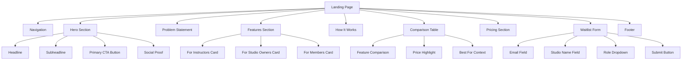
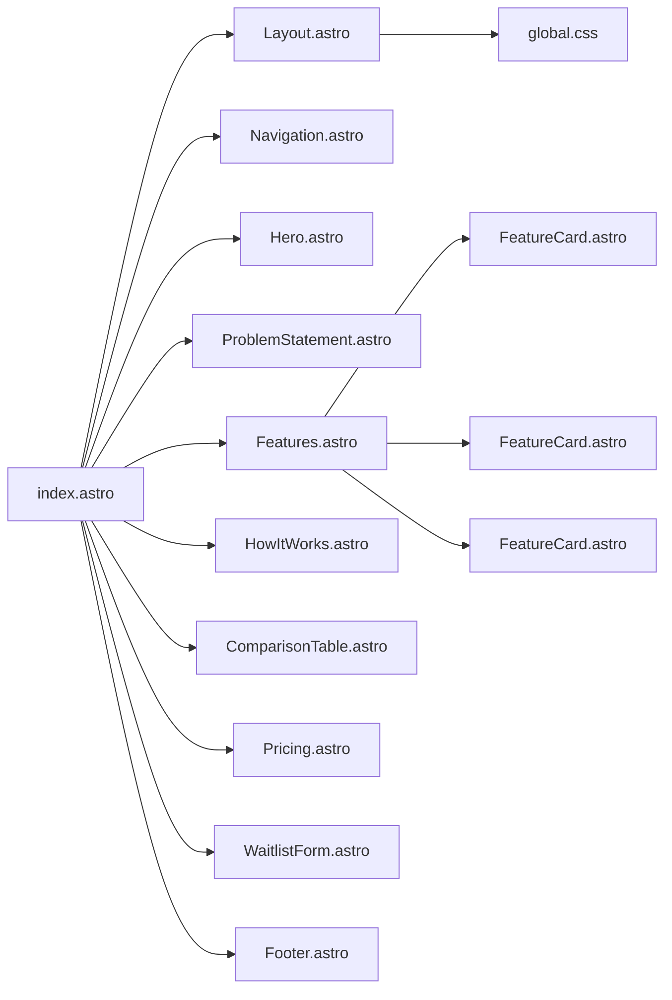
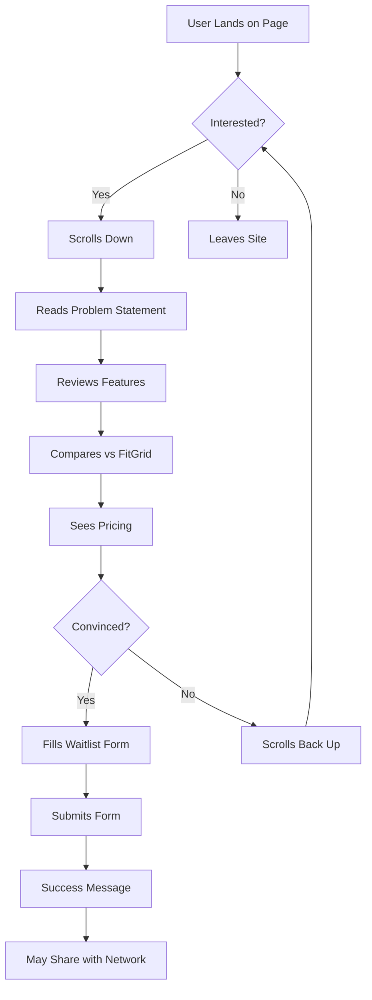
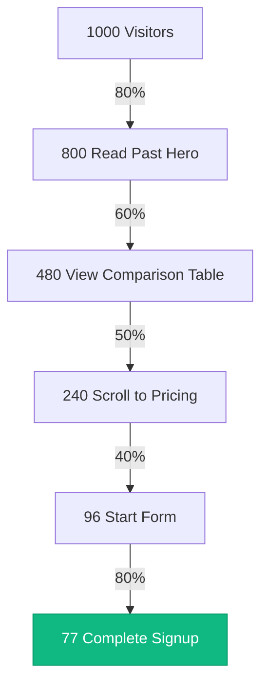

# StudioLoop Landing Page Flow & Structure

## Visual Page Flow

## Component Dependency Tree

## User Journey Flow

## Conversion Funnel

**Target Conversion Rate**: 7.7% (77 signups per 1000 visitors)

## Mobile vs Desktop Layout

### Desktop Layout (> 1024px)
- Three-column feature cards
- Side-by-side comparison table
- Wide hero with large typography
- Sticky navigation

### Tablet Layout (640px - 1024px)
- Two-column feature cards
- Condensed comparison table
- Medium-sized hero
- Standard navigation

### Mobile Layout (< 640px)
- Single-column stacked layout
- Card-based comparison (no table)
- Compact hero with smaller text
- Hamburger menu (if needed)

## Color Usage Map

| Section | Primary Color | Secondary Color | Accent Color |
|---------|---------------|-----------------|--------------|
| Navigation | White BG | Indigo (CTA) | - |
| Hero | White BG | Indigo (CTA) | Pink (gradient) |
| Problem | Gray 50 BG | - | Emerald (savings) |
| Features | White BG | Indigo (icons) | - |
| How It Works | Gray 50 BG | Indigo (numbers) | - |
| Comparison | White BG | Indigo (highlight) | Emerald (checkmarks) |
| Pricing | Gradient BG | Pink | Emerald (included) |
| Waitlist | White BG | Indigo (button) | - |
| Footer | Gray 900 BG | White text | - |

## Interaction Points

1. **Navigation CTA** → Smooth scroll to waitlist form
2. **Hero CTA** → Smooth scroll to waitlist form
3. **Feature Cards** → Hover effects, subtle animations
4. **Comparison Table** → Highlight StudioLoop column
5. **Pricing CTA** → Scroll to waitlist form
6. **Form Fields** → Real-time validation
7. **Submit Button** → Loading state → Success message

## Performance Targets

- **First Contentful Paint**: < 1.5s
- **Largest Contentful Paint**: < 2.5s
- **Time to Interactive**: < 3.5s
- **Cumulative Layout Shift**: < 0.1
- **Total Page Size**: < 500KB

## Accessibility Checklist

- [ ] Semantic HTML throughout
- [ ] ARIA labels on interactive elements
- [ ] Keyboard navigation support
- [ ] Focus indicators visible
- [ ] Color contrast ratios meet WCAG AA
- [ ] Form labels properly associated
- [ ] Alt text on all images
- [ ] Skip to main content link

## Browser Support

- Chrome/Edge: Last 2 versions
- Firefox: Last 2 versions
- Safari: Last 2 versions
- Mobile Safari: iOS 14+
- Chrome Mobile: Android 10+

---

## Implementation Priority

### Phase 1: Foundation (Must Have)
1. Layout.astro with proper meta tags
2. Navigation component
3. Hero section
4. Features section
5. Comparison table
6. Waitlist form
7. Footer

### Phase 2: Enhancement (Should Have)
1. Problem statement section
2. How it works section
3. Pricing section with visual appeal
4. Form validation
5. Smooth scrolling

### Phase 3: Polish (Nice to Have)
1. Micro-interactions
2. Animations on scroll
3. Loading states
4. Success messages
5. Error handling refinement