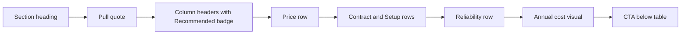

# COMPARISON: High‑Converting Comparison Table Design and Implementation Guide

Document purpose: An authoritative guide to design, implement, and optimize a high‑converting comparison table for the StudioLoop landing page, synthesizing component analysis and research insights.

Audience: Developers, designers, and stakeholders focused on conversion.

Status: v1.0 (2025‑10‑25)

Related files: ['ComparisonTable.astro'](src/components/ComparisonTable.astro), ['LANDING_PAGE_OPTIMIZATION_STRATEGY.md'](docs/LANDING_PAGE_OPTIMIZATION_STRATEGY.md), ['GEMINI_DEEP_RESEARCH.md'](docs/GEMINI_DEEP_RESEARCH.md), ['CHATGPT_DEEP_RESEARCH.md'](docs/CHATGPT_DEEP_RESEARCH.md)

---

Table of contents
1. Executive summary
2. Current component analysis
3. Visual hierarchy and behavioral psychology
4. Content strategy and copy patterns
5. Responsive design patterns
6. Micro‑interactions that aid conversion
7. Strategic specifications (badges, emphasis, pricing, CTAs)
8. Technical implementation roadmap (Astro, a11y, performance, integration)
9. Strategic marketing synthesis and positioning
10. Metrics, instrumentation, and experimentation plan
11. Developer checklist and acceptance criteria
12. Appendix: Data model and reusable row patterns

---

1. Executive summary
- Goal: Increase consideration‑to‑conversion by making the preferred choice (StudioLoop) the default, obvious selection while maintaining transparency.
- Core levers: visual emphasis, clear differentiators, quantified savings and ROI, reduced friction, credible proof, and repeated CTAs.
- What we have: A solid baseline with semantic table markup, desktop and mobile variants, and color emphasis on StudioLoop.
- What to add next: reliability row, social proof, annual cost visual, refined copy, analytics instrumentation, and a badge/label system aligned with urgency and exclusivity.
- Expected outcome: +10‑20% uplift from table changes alone; larger gains when combined with FAQ and CTA optimizations noted in ['LANDING_PAGE_OPTIMIZATION_STRATEGY.md'](docs/LANDING_PAGE_OPTIMIZATION_STRATEGY.md).

---

2. Current component analysis
Component: ['ComparisonTable.astro'](src/components/ComparisonTable.astro)

Strengths
- Semantics: Proper use of section + aria-labelledby and table roles (see header id at ['h2'](src/components/ComparisonTable.astro:14) and table at ['table'](src/components/ComparisonTable.astro:24)).
- Clear column emphasis: Recommended label and brand color on StudioLoop column header (['thead'](src/components/ComparisonTable.astro:25) → ['th'](src/components/ComparisonTable.astro:29)).
- Benefit‑led highlights: Price and setup time emphasized with color and weight (e.g., ['$29 cell'](src/components/ComparisonTable.astro:39), ['5 minutes'](src/components/ComparisonTable.astro:89)).
- Responsive variant: Desktop table + mobile card stack with highlighted StudioLoop card (['mobile container'](src/components/ComparisonTable.astro:106), ['StudioLoop card'](src/components/ComparisonTable.astro:145)).
- Accessible icons: sr‑only text for availability markers (e.g., ['span.sr-only'](src/components/ComparisonTable.astro:47)).

Weaknesses and gaps
- Missing reliability/UX row: No row for FitGrid Pro App rating and StudioLoop simplicity (add “Instructor App Rating / Automation” row as per ['LANDING_PAGE_OPTIMIZATION_STRATEGY.md'](docs/LANDING_PAGE_OPTIMIZATION_STRATEGY.md)).
- Social proof absent: No testimonial pull‑quote adjacent to the table; lacks trust‑building context.
- Annual cost framing: Savings claim exists below table, but no visual price bars to anchor the delta.
- Copy specificity: Feature labels are terse; they should connect to outcomes (retention, spend) referenced in ['CHATGPT_DEEP_RESEARCH.md'](docs/CHATGPT_DEEP_RESEARCH.md).
- CTA friction: Single CTA placement; recommend one immediately below table and one sticky on mobile.
- Icon semantics: Checkmarks with aria‑label “Available” are used on both columns; consider contrastive icons for negatives and add text labels for assistive tech consistency.
- Inline JS hover handlers: Button hover uses inline onmouseover/onmouseout; prefer CSS for performance and a11y consistency.

Must‑keep implementation patterns
- Retain semantic table on desktop for scan efficiency.
- Retain card‑based mobile layout with a highlighted StudioLoop card for pre‑selection effect.
- Keep brand color for emphasis but ensure sufficient contrast per WCAG 2.2.

---

3. Visual hierarchy and behavioral psychology
Primary principle: Make the recommended choice the path of least resistance while being truthful and transparent.

Techniques
- Column pre‑selection: Use brand color header, subtle column background striping, and “Recommended” badge to anchor attention.
- Row contrast for differentiators: Apply tinted background only in StudioLoop column for key wins (price, setup, contract) to create a consistent pattern of “wins”.
- Anchoring: Show higher competitor price first, then our price with a “Save $X/year” sublabel. This leverages price anchoring and contrast effect.
- Social proof proximity: Place a short pull‑quote just above the table to reduce perceived risk before comparison.
- Scarcity/urgency: Add “Launch pricing – limited to first 50 studios” as a badge near the StudioLoop header and replicate below with small print to avoid banner blindness.
- Eye‑flow helpers: Left‑align feature labels, center values; widen the preferred column slightly on desktop to create mild dominance.
- Decoy avoidance: Avoid adding a third column unless intentionally designing a decoy; keep two‑column comparison to reduce cognitive load at this stage.

Color and typography
- Use the existing rose/pink brand as the sole accent for wins and CTAs; neutrals for FitGrid cells to avoid accidental emphasis.
- Typography ladder: Feature labels at 0.875–1rem, values at 1rem, StudioLoop key value at 1.25–1.5rem bold; maintain consistent leading for readability.
- Spacing rhythm: 16–20px vertical rhythm between rows; extra 4–8px within the emphasized column cells for tactile feel.

Accessibility overlays
- Ensure 4.5:1 contrast for text on brand backgrounds; if not, add darker text or increase weight.
- Preserve focus outlines on interactive elements; do not rely solely on color to indicate selection or emphasis.

Mermaid: Attention flow across the component


---

4. Content strategy and copy patterns
Goals
- Highlight differentiators without over‑promising; tie each to a quantified outcome or cost reduction.
- Address core objections inline with the table using labels and tooltips.

Feature label patterns
- Monthly Price → “$29” with sublabel “Save $1,680–$3,552/yr”
- Annual contract → StudioLoop: “No contract” label; FitGrid: “Required” label
- Setup time → StudioLoop: “Live in 5 minutes”; FitGrid: “Complex”
- Reliability → FitGrid: “Instructor app 2.4★” vs StudioLoop: “No extra app needed – automated”
- Integration → “Mindbody certified” badge near StudioLoop cell

Evidence hooks
- Pull specific proof points from ['CHATGPT_DEEP_RESEARCH.md'](docs/CHATGPT_DEEP_RESEARCH.md): 87% spend increase, 35–46% return lift, 73% open rates.
- Add industry context from ['GEMINI_DEEP_RESEARCH.md'](docs/GEMINI_DEEP_RESEARCH.md): 50% churn in 6 months, retention vs acquisition cost.

Copy tone
- Reddit‑friendly: precise, transparent, practical; avoid hype and over‑claiming.

---

5. Responsive design patterns
Desktop
- Keep table layout with sticky header on scroll within the component container for long lists (optional).
- Consider sticky first column at lg+ to keep features visible.
- Slightly increase width of the StudioLoop column (e.g., w‑[40%] vs w‑[35%]).

Mobile
- Preserve separate cards for FitGrid and StudioLoop with the preferred card second but visually dominant (colored header, border‑2).
- Add a compact comparison summary chip group above the cards (e.g., “$29”, “No contract”, “5‑min setup”).
- Add a sticky CTA at the bottom of the viewport when the comparison section is in view.

Content priority
- Top order: Price → Setup → Contract → Reliability → Integration → Niche fit.

---

6. Micro‑interactions that aid conversion
- Row hover tint at desktop to guide scan (already present); ensure reduced motion respects prefers‑reduced‑motion.
- On focus within the table, highlight the entire row and the StudioLoop cell to aid keyboard users.
- Tooltip or info icons for claim substantiation (e.g., “Why 87%?”) opening a small dialog with a cite and link to case study.
- Animated annual cost bars on reveal below the table with a subtle grow animation (<300ms).
- CTA press state with slight scale and shadow for affordance; keep within 1.02 scale to avoid distraction.

---

7. Strategic specifications (badges, emphasis, pricing, CTAs)
Badge and label system
- Types: Recommended, Launch pricing, No contract, Mindbody certified, Risk‑free 60‑day guarantee.
- Visuals: Rounded pills, 12px–14px, medium weight, brand accent background for positive claims, neutral border for factual labels.
- Placement: Column header (Recommended), below price (Launch pricing), near contract row (No contract), integration row (Mindbody certified).

Visual emphasis recipes
- Preferred column header: brand background with white text and a smaller sublabel “Recommended”.
- Preferred wins: apply bg‑pink‑50 to StudioLoop win cells only to create a consistent stripe of success.
- Price row: use 1.5–1.75rem bold type on StudioLoop; fit grid price stays small and neutral.

Feature comparison methodology
- Maintain transparency: for each differentiator, include the competitor’s factual state without exaggeration.
- Show parity items as neutral (same icons, same copy) to enhance credibility.
- Include a reliability row citing public ratings (FitGrid Pro 2.4★) and clarify StudioLoop removes the instructor app dependency.

Pricing presentation strategies
- Anchor with competitor monthly and annual totals, then show an explicit savings calculation below the table.
- Use a mini bar chart to visualize annual cost difference; label values directly (no y‑axis needed).
- Add “No long‑term contract” near the CTA as risk reversal reinforcement.

CTA optimization
- Primary CTA below table: “Start Saving Today” or “Get Early Access (Save $1,800/Year)”.
- Add a secondary text link: “See the proof” anchored to an ROI section.
- On mobile, use a sticky bottom CTA when the comparison section is visible.

---

8. Technical implementation roadmap
Component architecture
- Keep ['ComparisonTable.astro'](src/components/ComparisonTable.astro) as the orchestrator; extract presentational sub‑components if complexity grows:
  - ComparisonHeader (renders heading, optional pull‑quote)
  - ComparisonTableDesktop
  - ComparisonCardsMobile
  - AnnualCostVisual
  - ComparisonCTA

Accessibility (WCAG 2.2 AA)
- Semantic roles preserved: table/thead/tbody/th/td for desktop; ensure aria‑labeling for cards on mobile conveys “comparison”.
- Labels for icons: ensure each icon cell has visually hidden text conveying state (“Available”, “Required”, “Not needed”).
- Focus management: focus ring visible for links, buttons, and any tooltip triggers; ensure tab order follows visual reading order.
- Motion: respect prefers‑reduced‑motion for hover/animation effects.
- Contrast: verify brand pink on white meets 3:1 for large text and 4.5:1 for normal text; adjust shades as needed.

Performance
- Remove inline onmouseover/onmouseout in favor of CSS hover and focus styles.
- Avoid large inline SVGs duplication: extract checkmark to a shared component or use a CSS mask; or keep as‑is but deduplicate via a small Astro fragment.
- Minify SVG paths and ensure they are not re‑instantiated unnecessarily.
- Avoid layout shift: set fixed cell padding and font sizes; reserve space for badges.

Integration with existing system
- Styling: Continue with Tailwind utility classes consistent with ['global.css'](src/styles/global.css) and component patterns in ['Hero.astro'](src/components/Hero.astro) and ['Features.astro'](src/components/Features.astro).
- Navigation: Ensure section id matches nav anchor used by ['Navigation.astro'](src/components/Navigation.astro).
- CTA scroll: Replace inline JS with an anchor link to ['WaitlistForm.astro'](src/components/WaitlistForm.astro) section id, or use a small utility in ['utils.ts'](src/lib/utils.ts).

Analytics and instrumentation
- Add data‑attributes to primary CTA and key elements for tracking:
  - data‑loc="comparison.cta.primary"
  - data‑loc="comparison.annual_cost.visual"
  - data‑loc="comparison.pull_quote"
- Emit events as documented in ['ANALYTICS_AND_TRACKING.md'](docs/ANALYTICS_AND_TRACKING.md) or per GA4 snippet examples in ['LANDING_PAGE_OPTIMIZATION_STRATEGY.md'](docs/LANDING_PAGE_OPTIMIZATION_STRATEGY.md).

Implementation sequence (suggested)
1) Add reliability row (desktop + mobile)
2) Add pull‑quote above table
3) Add annual cost visual below table
4) Refine copy labels per patterns
5) Replace inline hover JS on CTA with CSS; add sticky mobile CTA
6) Add data‑attributes and GTM/GA tracking
7) QA a11y and responsiveness

---

9. Strategic marketing synthesis and positioning
- Competitive contrast: Leverage FitGrid weaknesses documented in ['GEMINI_DEEP_RESEARCH.md'](docs/GEMINI_DEEP_RESEARCH.md) around Pro App reliability and pricing to position StudioLoop as simple, reliable, and affordable.
- Target segments: Boutique studios with Mindbody who value “set‑and‑forget” automation over breadth; Reddit audience prefers transparent, data‑backed claims.
- Messaging pillars:
  1) Affordable retention (+87% spend signal; 90% cheaper)
  2) Simplicity and speed (5‑minute setup; no extra app)
  3) Reliability and trust (no contracts; money‑back guarantee)
- Proof points: 73% open rates, 35–46% return lift, annual savings $1,680–$3,552, industry retention context.

---

10. Metrics, instrumentation, and experimentation plan
Primary KPIs
- Section reach: % users reaching comparison
- CTA CTR: clicks/section viewers
- Assisted conversion: conversions where comparison was viewed

Secondary metrics
- Time in section, hover rate on rows, tooltip opens
- Scroll depth to annual cost visual

Targets (Phase 1, per strategy doc)
- Comparison CTA CTR: 20–25% (see targets in ['LANDING_PAGE_OPTIMIZATION_STRATEGY.md'](docs/LANDING_PAGE_OPTIMIZATION_STRATEGY.md))
- Section reach: 60%+
- Mobile sticky CTA interaction: 15%+

Experiment backlog
- Test “Get Early Access (Save $1,800/Year)” vs “Start Saving Today” on comparison CTA.
- Test presence of pull‑quote above table.
- Test sticky summary chips on mobile.

Event schema (GA4/GTM)
- event: cta_click, params: { button_location: "comparison", button_text, variant }
- event: scroll_depth, params: { section: "comparison", percentage }
- event: reveal, params: { element: "annual_cost_visual" }

---

11. Developer checklist and acceptance criteria
Implementation checklist
- [ ] Add reliability row to desktop and mobile variants
- [ ] Add pull‑quote above table and annual cost visual below
- [ ] Update copy labels and add badges per spec
- [ ] Replace inline JS hover handlers with CSS
- [ ] Add data‑loc attributes and tracking hooks
- [ ] Verify contrast and focus states; add sr‑only labels
- [ ] QA on mobile and desktop; test sticky CTA

Acceptance criteria
- Reliability row visible on both breakpoints; text contrasts ≥ 4.5:1
- Annual cost bars rendering without layout shift; labelled values
- StudioLoop column visibly dominant but compliant with WCAG
- GA4 events firing for comparison CTA and annual cost visual
- No inline JS used for hover/active states

---

12. Appendix: Data model and reusable row patterns
Suggested data structure for features (Astro/TS)

```ts
/**
 * Comparison feature row model
 */
export type ComparisonRow = {
  key: string; // e.g., 'price', 'setup', 'contract', 'reliability', 'integration', 'niche'
  label: string;
  fitgrid: { type: 'text' | 'icon'; value: string; sr?: string };
  studioloop: { type: 'text' | 'icon'; value: string; sr?: string; highlight?: boolean; badge?: string };
  note?: string; // optional tooltip or evidence hook id
};
```

Example rows

```ts
export const rows: ComparisonRow[] = [
  {
    key: 'price',
    label: 'Monthly Price',
    fitgrid: { type: 'text', value: '$169–$325', sr: 'FitGrid monthly price' },
    studioloop: { type: 'text', value: '$29', sr: 'StudioLoop monthly price', highlight: true, badge: 'Launch pricing' },
    note: 'savings'
  },
  {
    key: 'contract',
    label: 'Annual contract required',
    fitgrid: { type: 'text', value: 'Required', sr: 'Annual contract required' },
    studioloop: { type: 'text', value: 'No contract', sr: 'No annual contract', highlight: true, badge: 'Risk‑free' }
  },
  {
    key: 'setup',
    label: 'Setup time',
    fitgrid: { type: 'text', value: 'Complex', sr: 'Complex setup' },
    studioloop: { type: 'text', value: '5 minutes', sr: 'Five minute setup', highlight: true }
  },
  {
    key: 'reliability',
    label: 'Instructor app requirement',
    fitgrid: { type: 'text', value: 'Pro App 2.4★', sr: 'Instructor app rated 2.4 stars' },
    studioloop: { type: 'text', value: 'Not needed – automated', sr: 'No extra app required', highlight: true }
  }
];
```

Pull‑quote and cost visual placement
- Pull‑quote: immediately above the desktop table container; same inside mobile section above cards.
- Cost visual: immediately below the table/cards; ensure heading and bars are accessible with labels.

Integration notes
- Link the section CTA button to the waitlist section id in ['WaitlistForm.astro'](src/components/WaitlistForm.astro) using a standard anchor and smooth scroll utility.
- Add evidence hook tooltips linking to citations in ['CHATGPT_DEEP_RESEARCH.md'](docs/CHATGPT_DEEP_RESEARCH.md) and ['GEMINI_DEEP_RESEARCH.md'](docs/GEMINI_DEEP_RESEARCH.md).

End of document