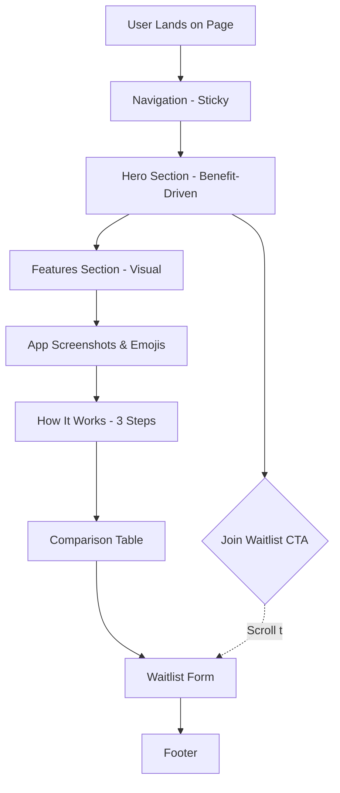
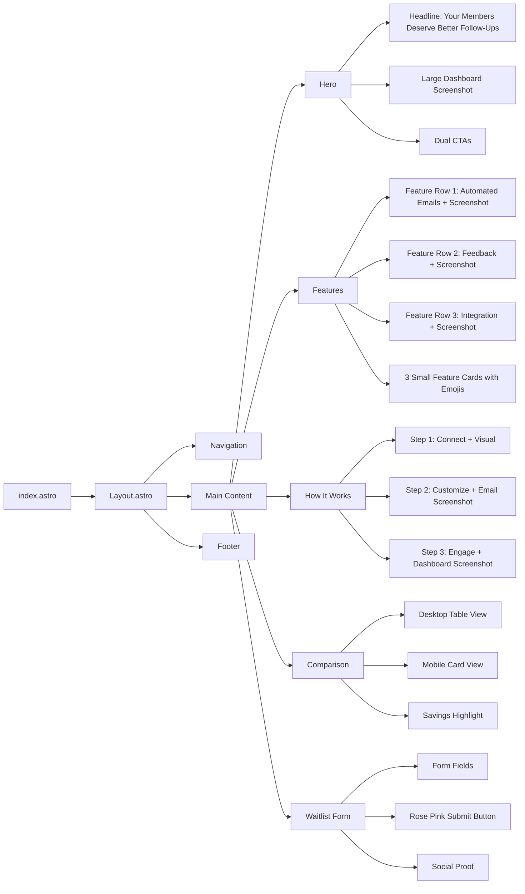
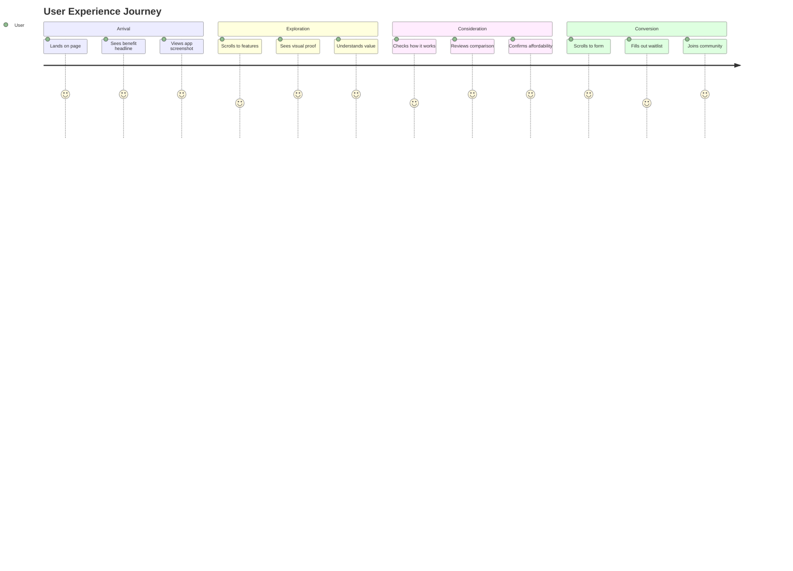

# FitnessFollowup Redesign - Page Flow & Visual Hierarchy

This document provides a visual overview of the redesigned page structure inspired by aboardhr.com.

---

## Overall Page Structure



---

## Component Hierarchy



---

## Visual Layout - Desktop View

```
╔════════════════════════════════════════════════════════════╗
║  📱 FitnessFollowup Logo                    [Join Waitlist]     ║ ← Navigation (Sticky, White)
╠════════════════════════════════════════════════════════════╣
║                                                            ║
║              Your Members Deserve                          ║
║              Better Follow-Ups                             ║  ← Hero Section
║                                                            ║  (White/Gradient BG)
║         Strengthen connections with automated...           ║
║                                                            ║
║      [Join the Waitlist]  [See How It Works]              ║
║                                                            ║
║    ┌──────────────────────────────────────────────┐       ║
║    │                                              │       ║
║    │     [Instructor Dashboard Screenshot]       │       ║  ← Large App Image
║    │     (Rounded, shadow, 1100px wide)          │       ║  (Pink shadow/border)
║    │                                              │       ║
║    └──────────────────────────────────────────────┘       ║
║                                                            ║
╠════════════════════════════════════════════════════════════╣
║  Everything You Need to Connect with Members               ║
║  Simple, powerful features that help you build...          ║  ← Features Section
║                                                            ║  (White BG)
║  ┌───────────────────┐         ┌──────────────────┐       ║
║  │ 📧 Automated      │         │   [Email Editor  │       ║
║  │ Post-Class Emails │         │    Screenshot]   │       ║  ← Feature Row 1
║  │ Description...    │         │                  │       ║  (Text Left, Image Right)
║  └───────────────────┘         └──────────────────┘       ║
║                                                            ║
║  ┌──────────────────┐         ┌───────────────────┐       ║
║  │  [Feedback Page  │         │ ⭐ Detailed       │       ║
║  │   Screenshot]    │         │ Member Feedback   │       ║  ← Feature Row 2
║  │                  │         │ Description...    │       ║  (Image Left, Text Right)
║  └──────────────────┘         └───────────────────┘       ║
║                                                            ║
║  ┌───────────────────┐         ┌──────────────────┐       ║
║  │ 🔗 One-Click      │         │  [Dashboard      │       ║
║  │ MindBody Sync     │         │   Screenshot]    │       ║  ← Feature Row 3
║  │ Description...    │         │                  │       ║  (Text Left, Image Right)
║  └───────────────────┘         └──────────────────┘       ║
║                                                            ║
║  ┌────────┐  ┌────────┐  ┌────────┐                      ║
║  │💰      │  │⚡      │  │📊      │                      ║  ← Small Feature Cards
║  │Pricing │  │Setup   │  │Analytics│                     ║  (3 columns)
║  └────────┘  └────────┘  └────────┘                      ║
║                                                            ║
╠════════════════════════════════════════════════════════════╣
║            Get Started in Minutes                          ║
║   Three simple steps to transform your member engagement   ║  ← How It Works
║                                                            ║  (Gradient BG:
║   ┌──────────────────────────────────────────────┐        ║   White to Pink-50)
║   │  ①  🔗 Connect Your Studio in Minutes        │        ║
║   │     Description + Small visual               │        ║
║   └──────────────────────────────────────────────┘        ║
║                        ↓                                   ║
║   ┌──────────────────────────────────────────────┐        ║
║   │  ②  ✏️ Create Your Perfect Follow-Up         │        ║
║   │     Description + Email screenshot           │        ║
║   └──────────────────────────────────────────────┘        ║
║                        ↓                                   ║
║   ┌──────────────────────────────────────────────┐        ║
║   │  ③  💌 Watch Engagement Grow                 │        ║
║   │     Description + Dashboard screenshot       │        ║
║   └──────────────────────────────────────────────┘        ║
║                                                            ║
║              [Start Your Free Setup]                       ║
║                                                            ║
╠════════════════════════════════════════════════════════════╣
║        The Smart Choice for Boutique Studios               ║
║   All the features you need, none of the complexity...     ║  ← Comparison Table
║                                                            ║  (White BG)
║   ┌──────────────────────────────────────────────┐        ║
║   │ Feature    │  FitGrid   │  FitnessFollowup (Pink) │        ║
║   ├──────────────────────────────────────────────┤        ║
║   │ Price      │ $169-325   │  $29 (Large/Bold)  │        ║
║   │ Features   │  ✓ Gray    │  ✓ Pink            │        ║
║   │ Contract   │  Required  │  No Contract ✓     │        ║
║   └──────────────────────────────────────────────┘        ║
║                                                            ║
║     Save $1,800+ per year with FitnessFollowup                  ║
║              [Start Saving Today →]                        ║
║                                                            ║
╠════════════════════════════════════════════════════════════╣
║      Ready to Transform Member Engagement?                 ║
║                                                            ║  ← Waitlist Form
║   ┌─────────────────────────────────────────┐             ║  (Pink-50 BG)
║   │                                         │             ║
║   │  [Email Input]                          │             ║
║   │  [Studio Name Input]                    │             ║
║   │  [Role Dropdown]                        │             ║
║   │                                         │             ║
║   │  [Join Waitlist - Pink Button]          │             ║  ← Large Pink Button
║   │                                         │             ║
║   │  "Join 200+ studios waiting..."         │             ║
║   │                                         │             ║
║   └─────────────────────────────────────────┘             ║
║                                                            ║
╠════════════════════════════════════════════════════════════╣
║  FitnessFollowup                   Contact: hello@FitnessFollowup.io ║
║  Built with ❤️ for boutique   Privacy | Terms             ║  ← Footer (Minimal)
║  fitness studios              © 2024 FitnessFollowup           ║
╚════════════════════════════════════════════════════════════╝
```

---

## Mobile Layout (< 640px)

```
╔═══════════════════════════╗
║ 📱 Logo    [Join]         ║ ← Compact Nav
╠═══════════════════════════╣
║                           ║
║  Your Members Deserve     ║
║  Better Follow-Ups        ║ ← Hero (Stacked)
║                           ║
║  Description text...      ║
║                           ║
║  [Join Waitlist]          ║
║  [See How It Works]       ║
║                           ║
║  ┌─────────────────────┐  ║
║  │   [Dashboard        │  ║
║  │    Screenshot]      │  ║ ← Full Width Image
║  │  (Responsive)       │  ║
║  └─────────────────────┘  ║
║                           ║
╠═══════════════════════════╣
║  Features                 ║
║                           ║
║  ┌─────────────────────┐  ║
║  │  [Screenshot]       │  ║
║  └─────────────────────┘  ║
║  📧 Automated Emails      ║ ← Stacked: Image
║  Description...           ║   then Text
║                           ║
║  ┌─────────────────────┐  ║
║  │  [Screenshot]       │  ║
║  └─────────────────────┘  ║
║  ⭐ Member Feedback       ║
║  Description...           ║
║                           ║
║  [Continue pattern...]    ║
║                           ║
╠═══════════════════════════╣
║  How It Works             ║
║                           ║
║  ┌───────────────────┐    ║
║  │  ①  Connect       │    ║
║  │  Description      │    ║ ← Vertical Steps
║  └───────────────────┘    ║
║           ↓               ║
║  ┌───────────────────┐    ║
║  │  ②  Customize     │    ║
║  │  + Screenshot     │    ║
║  └───────────────────┘    ║
║           ↓               ║
║  ┌───────────────────┐    ║
║  │  ③  Engage        │    ║
║  │  Description      │    ║
║  └───────────────────┘    ║
║                           ║
╠═══════════════════════════╣
║  Comparison               ║
║                           ║
║  ┌─────────────────────┐  ║
║  │ FitnessFollowup (Pink)   │  ║
║  │ $29/month           │  ║ ← Card-based
║  │ ✓ Features          │  ║   Comparison
║  │ ✓ No contract       │  ║
║  └─────────────────────┘  ║
║           vs              ║
║  ┌─────────────────────┐  ║
║  │ FitGrid             │  ║
║  │ $169-325/month      │  ║
║  │ ✓ Features          │  ║
║  │ ✗ Contract required │  ║
║  └─────────────────────┘  ║
║                           ║
╠═══════════════════════════╣
║  Waitlist Form            ║
║                           ║
║  [Email]                  ║
║  [Studio Name]            ║
║  [Role]                   ║ ← Full Width Form
║                           ║
║  [Join Waitlist]          ║ ← Full Width Button
║                           ║
╠═══════════════════════════╣
║  Footer (Minimal)         ║
╚═══════════════════════════╝
```

---

## Color Usage Map

### Rose Pink (#fb7185) - Primary Brand Color

**Used in:**

- Navigation: "Join Waitlist" button background
- Hero: Primary CTA button background
- Features: App UI elements in screenshots (buttons, accents)
- Features: Checkmarks and highlights
- How It Works: Step number circles background
- Comparison: FitnessFollowup column highlights, checkmarks, price emphasis
- Waitlist: Submit button background
- Footer: Link hover states

### Pink-50 (#fff1f2) - Subtle Backgrounds

**Used in:**

- Hero: Optional subtle gradient background
- Features: Alternating row backgrounds
- Waitlist: Section background

### Pink-100 (#ffe4e6) - Hover States

**Used in:**

- Button hover states (slightly darker than base pink)
- Interactive element highlights

### Neutral Grays

**Primary Text** (Neutral-900 #171717):

- All headlines
- Important copy

**Body Text** (Neutral-600 #525252):

- Descriptions
- Supporting copy

**Backgrounds**:

- White: Main sections
- Neutral-50: Subtle section variations

---

## Image Assets Checklist

### Required Screenshots (1200x800px PNG)

- [ ] `instructor-dashboard.png` - Main dashboard view (Hero section)
- [ ] `client-feedback.png` - Feedback/ratings page (Features section)
- [ ] `email-followup.png` - Email editor interface (Features & How It Works)
- [ ] Dashboard connection status (optional, can reuse instructor-dashboard.png)

### Placeholder Strategy

**During Development:**

- Use solid color rectangles with dimensions noted
- Add text overlay: "Dashboard Screenshot - 1200x800"
- Background color: Pink-100 with border

**Final Assets:**

- Generate with AI using provided prompts
- Or create actual screenshots from built app
- Optimize for web (compress to ~150-200KB per image)

---

## User Journey Flow



---

## Interaction Points

### Call-to-Action Hierarchy

**Primary CTAs** (Rose Pink buttons):

1. Navigation: "Join Waitlist"
2. Hero: "Join the Waitlist"
3. How It Works: "Start Your Free Setup"
4. Comparison: "Start Saving Today"
5. Waitlist Form: "Join Waitlist"

**Secondary CTAs** (Outlined buttons):

1. Hero: "See How It Works" (scrolls to How It Works section)

### Scroll Behavior

All "Join Waitlist" buttons → Smooth scroll to Waitlist Form section
"See How It Works" button → Smooth scroll to How It Works section

### Hover States

- **Buttons**: Darken by one shade (#fb7185 → #f43f5e)
- **Links**: Underline + pink color
- **Cards**: Subtle shadow increase
- **Images**: None (static)

---

## Responsive Breakpoints Summary

### Desktop (≥ 1024px)

- Two-column feature layouts
- Wide comparison table
- Large hero image (1100px max-width)
- Generous spacing

### Tablet (640px - 1023px)

- Single column features (image stacked on text)
- Comparison table starts to condense
- Medium spacing
- Maintain visual hierarchy

### Mobile (< 640px)

- All single column
- Card-based comparison
- Stacked navigation elements
- Larger touch targets (min 44px)
- Reduced spacing but maintained readability

---

## Success Indicators

**Visual Impact:**

- User sees app within 2 seconds
- Clear value proposition immediately visible
- Strong color consistency (rose pink throughout)

**User Understanding:**

- Can explain product in 30 seconds after viewing
- Understands pricing instantly
- Knows how to get started

**Conversion Optimization:**

- Multiple CTA opportunities (5 main buttons)
- Clear next step at every section
- Minimal friction to join waitlist
- Social proof elements present

---

## Development Notes

### Order of Implementation

1. **Phase 1**: Update colors, create placeholders
2. **Phase 2**: Hero + Navigation (most visible)
3. **Phase 3**: Features (content-heavy)
4. **Phase 4**: How It Works + Comparison
5. **Phase 5**: Waitlist Form + Footer
6. **Phase 6**: Polish + responsive testing

### Critical Path

Hero → Features → How It Works → Comparison → Waitlist

These must flow seamlessly for optimal conversion.
